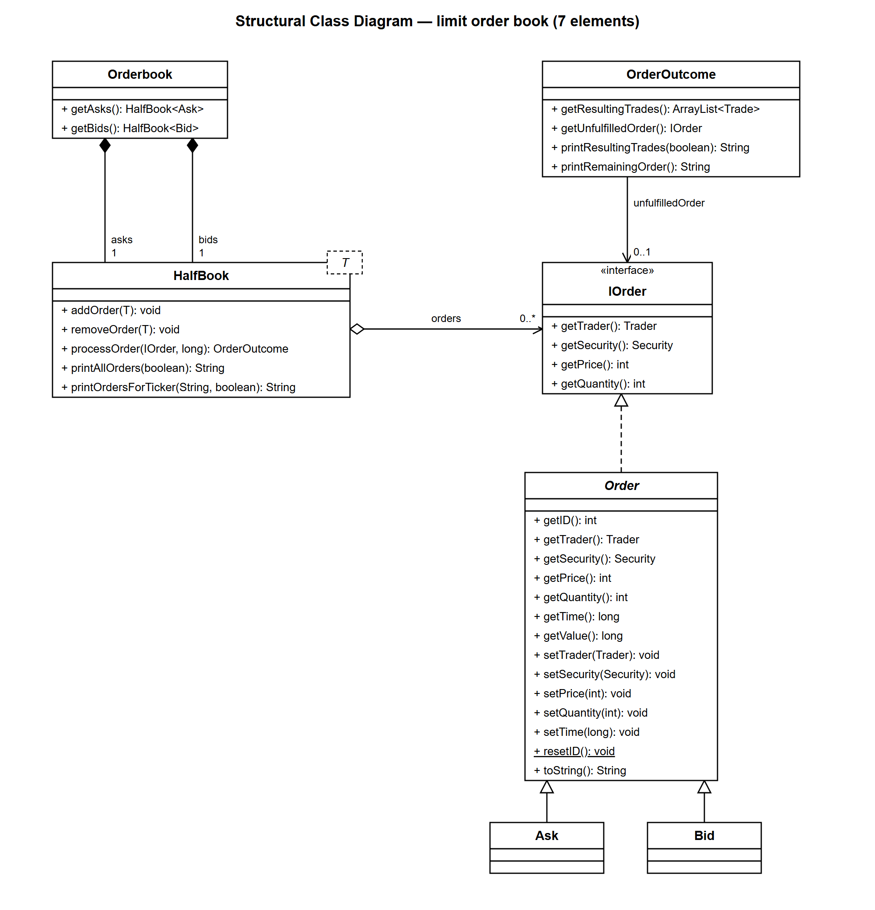
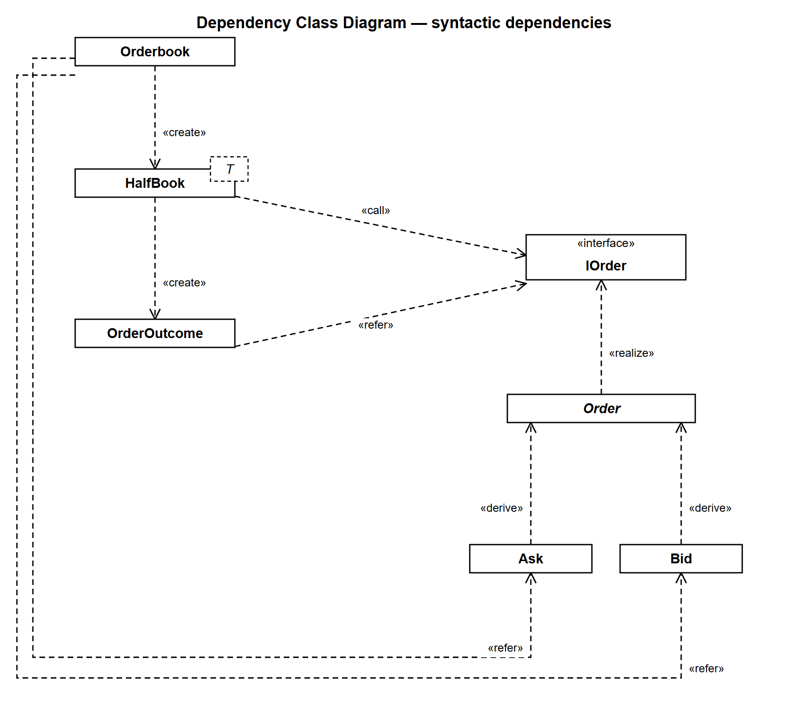
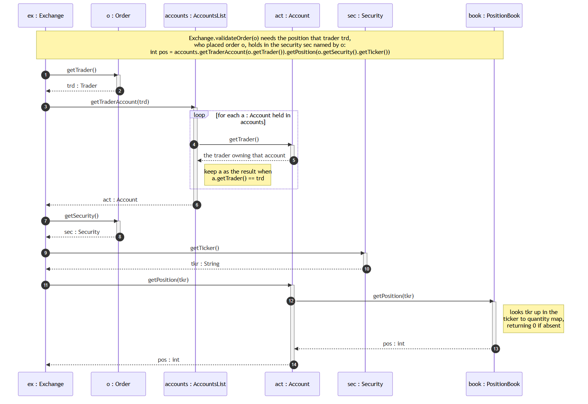

# Assignment 1 — Design Models

Answers to Questions 1–3. Each diagram is provided as **PNG** (the format the questions ask to be
submitted) and as SVG for a crisper zoom.

The core-library classes (`Orderbook`, `HalfBook`, `OrderOutcome`, `IOrder`, `Order`, `Ask`,
`Bid`) come from `bin/lib/core-0.0.1-SNAPSHOT.jar`. Their members were read from the Javadoc under
`/apidocs`; the JAR was not decompiled.

| Question | Diagram | File to submit |
| --- | --- | --- |
| 1 | Structural class diagram | [`q1-structural-class-diagram.png`](img/q1-structural-class-diagram.png) |
| 2 | Dependency class diagram | [`q2-dependency-class-diagram.png`](img/q2-dependency-class-diagram.png) |
| 3 | Sequence diagram | [`q3-sequence-diagram.png`](img/q3-sequence-diagram.png) |

---

## Question 1 — Structural class diagram



Exactly the seven required elements and nothing else: **Orderbook, HalfBook, OrderOutcome,
IOrder, Order, Ask, Bid**.

Against the question's notes and hints:

* **Attributes ignored** — each class shows an empty attribute compartment.
* **All relevant methods, no constructors** — which is why `Ask` and `Bid` have empty operation
  compartments: the only member either one declares is its constructor.
* **IOrder shows four methods only**, as instructed: `getTrader`, `getSecurity`, `getPrice` and
  `getQuantity` — the four the order book actually needs in order to match an order.
* **Generic class notation** — `HalfBook` carries the dashed `T` template box in its top-right
  corner, following the example given in the question.
* `Order` is abstract, so its name is *italic*; `resetID()` is static, so it is underlined;
  `IOrder` carries the «interface» stereotype.

### The structural relationships

| Relationship | Kind | Reading |
| --- | --- | --- |
| `Orderbook` ◆— `HalfBook` (`asks`, 1) | composition | The order book *is* its two half-books: they are created with it and die with it. |
| `Orderbook` ◆— `HalfBook` (`bids`, 1) | composition | The same class, bound to `Bid` instead of `Ask`. |
| `HalfBook` ◇— `IOrder` (`orders`, 0..*) | aggregation | A half-book holds the orders resting in it. They arrive from outside and leave again on `removeOrder`, so it references them rather than owning them. The target is `IOrder` because the type parameter is declared `T extends IOrder`. |
| `OrderOutcome` → `IOrder` (`unfulfilledOrder`, 0..1) | association | Whatever quantity of the incoming order went unfilled. `0..1`, because a fully-filled order leaves nothing behind. |
| `Order` ⇢▷ `IOrder` | realisation | `Order` implements the interface. |
| `Ask` —▷ `Order`, `Bid` —▷ `Order` | generalisation | Each adds only a constructor; all state and behaviour is inherited. |

`OrderOutcome` also aggregates the `Trade` objects it reports, but `Trade` is not one of the seven
permitted elements, so that relationship is out of scope here.

---

## Question 2 — Dependency class diagram



The same seven classes, with every relationship now a *syntactic dependency*, using only the
stereotypes the question lists. The class boxes are name-only: their members are already given in
Question 1, and the subject here is the arrows.

| Dependent | Stereotype | Supplier | Justification |
| --- | --- | --- | --- |
| `Orderbook` | «create» | `HalfBook` | Constructs both half-books. `create` implies `refer`. |
| `Orderbook` | «refer» | `Ask` | Named in the return type of `getAsks(): HalfBook<Ask>`. |
| `Orderbook` | «refer» | `Bid` | Named in the return type of `getBids(): HalfBook<Bid>`. |
| `HalfBook` | «call» | `IOrder` | `processOrder(IOrder, long)` takes one and calls its accessors to compare price and quantity. `call` implies `refer`. |
| `HalfBook` | «create» | `OrderOutcome` | `processOrder` builds the outcome object that it returns. |
| `OrderOutcome` | «refer» | `IOrder` | Named in its constructor parameter and in `getUnfulfilledOrder()`. |
| `Order` | «realize» | `IOrder` | `Order` implements the interface. |
| `Ask` | «derive» | `Order` | `Ask extends Order`. |
| `Bid` | «derive» | `Order` | `Bid extends Order`. |

Note the pair of arrows routed around the bottom of the drawing: `Orderbook` depends on `Ask` and
`Bid` even though it never touches an order directly. It names them purely as the type arguments
that bind each half-book.

---

## Question 3 — Sequence diagram



The scenario asked for: **an `Exchange` object obtaining the position that the trader who submitted
an `Order` holds in the `Security` named by that order.** In the code this is the single statement
inside `Exchange.validateOrder`:

```java
int pos = accounts.getTraderAccount(o.getTrader()).getPosition(o.getSecurity().getTicker());
```

Objects are named as the question requires: the trader is **trd**, the security **sec** and the
account **act**.

The collaboration runs in five steps:

1. `ex : Exchange` asks `o : Order` for `getTrader()` — the trader **trd** who placed it.
2. `ex` passes **trd** to `accounts : AccountsList.getTraderAccount(trd)`. That method walks its
   list, calling `getTrader()` on each `Account` and keeping the one whose trader is **trd**. It
   returns **act**.
3. `ex` asks `o` for `getSecurity()` — the security **sec** the order is for.
4. `ex` asks `sec` for `getTicker()`, since positions are keyed by the ticker string.
5. `ex` calls `act.getPosition(tkr)`, which delegates to that account's `book : PositionBook`,
   where the ticker is looked up in a map of ticker → quantity. The quantity travels back to `ex`
   as `pos`.

All five classes the question lists appear. `PositionBook` is included as well because
`Account.getPosition` is a one-line delegation to it — it is where the position actually lives, so
the collaboration would be incomplete without it.

---

## Questions 4 and 5 — Code and tests

`Exchange.java` is complete and the test suite passes:

```
git clone https://github.com/Faraivar/itec3030-a1-lob
cd itec3030-a1-lob
mvn test
```

`ExchangeTest.testSubmitOrder` loads the four CSV fixtures from `src/test/resources/`, replays the
orders through `submitOrder`, and asserts the exact resting ask book (26 rows), resting bid book
(30 rows), trade log (70 trades), all eight closing balances, and the total fees collected
(`$1,154.50`).
